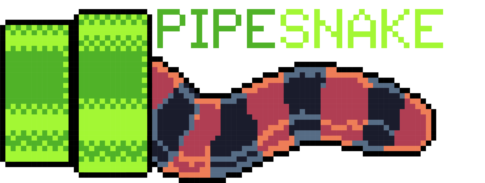

<!--  -->

👋 Welcome to the ***pipesnake*** documentation. Let's get started.

***pipesnake*** is a bioinformatics best-practice analysis pipeline for phylogenomic reconstruction starting from short-read 'second-generation' sequencing data.

The pipeline is built using [nextflow](https://www.nextflow.io), a workflow tool to run tasks across varied compute infrastructures in a portable manner. All software are packaged in Docker/Singularity containers making installation trivial and results highly reproducible.

Once you've got nextflow, installing ***pipesnake*** is as easy as:
```
nextflow pull ausarg/pipesnake
```
<!--
## Next


  

-->